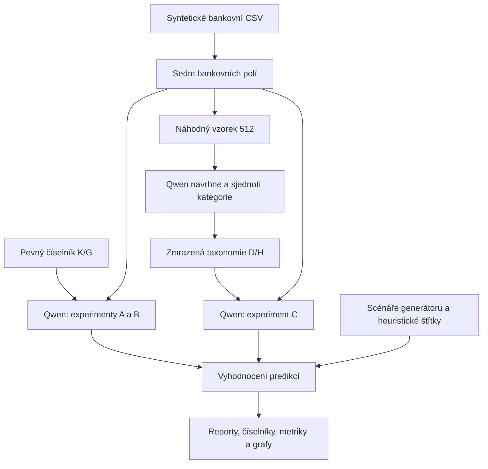

# XLLMA: postup projektu, rozhodnutí a výsledky

Stav dokumentace: **9. 10. 2026**. Dokument zachycuje dosavadní projektovou práci, důvody změn a tři dokončené experimenty. Číselné výsledky vycházejí z uložených manifestů a vyhodnocení; popis historických kroků vychází z průběhu práce. Odstraněným pilotům a dřívějším verzím dat nepřisuzujeme zpětně neuložené výsledky.

## 1. Cíl a současný stav

Cílem je ověřit, jak lokální jazykový model kategorizuje české bankovní transakce. Postupně jsme rozlišili dvě úlohy:

1. **Klasifikace do předem stanovených kategorií:** model vybírá podrobnou a hlavní kategorii z dodaného číselníku.
2. **Návrh vlastní taxonomie a následná klasifikace:** model nejprve vytvoří kategorie z neoznačených plateb a potom podle nich označuje transakce.

Projekt začal na soukromých bankovních výpisech. Kvůli ochraně před odvozováním osobního chování jsme je později úplně nahradili nezávisle vygenerovanými transakcemi. **Všechny současné experimenty používají plně syntetická data.** Výsledky popisují model a generovaný dataset, nikoli finanční chování majitele projektu.

| Oblast | Současný stav |
|---|---|
| Dataset | 10 625 transakcí: 1 625 syntetických referenčních a 9 000 hlavních syntetických |
| Období provedení transakcí | 1. 1. 2022 až 5. 10. 2026 |
| Profily hlavní sady | 12 smyšlených profilů |
| Pevná taxonomie | 89 podrobných kategorií a 15 hlavních skupin |
| Skutečně zastoupené scénáře | 68 podrobných kategorií a 14 hlavních skupin |
| Použitý LLM | `qwen3.5:4b` přes lokální Ollamu 0.34.0 |
| Dokončené experimenty | Pevná taxonomie v dávce 16; pevná taxonomie po jedné; vlastní taxonomie v dávce 16 |
| Taxonomie navržená Qwenem | 29 kategorií a 14 hlavních skupin; při klasifikaci použito 28 kategorií |

Praktický přehled souborů a běžných příkazů je v [data/README.md](data/README.md). Tento dokument vysvětluje také vývoj řešení a důvody jednotlivých rozhodnutí.

## 2. Příprava dat a první anonymizace

### 2.1 Sloučení bankovních CSV

Začali jsme požadavkem spojit jednotlivé roční a bankovní exporty do jednoho CSV. Výstupem byl `data_all.csv`, který vytvořil jednotný podklad pro analýzu a pozdější generování.

Podstatné bylo zachovat bankovní sloupce, správně číst české texty a nezaměňovat desetinnou čárku za oddělovač CSV. Současné soubory používají **UTF-8, středník jako oddělovač a desetinnou čárku v částkách**. Úplnost kombinované sady se nyní kontroluje porovnáním bankovních řádků obou zdrojových sad s `data_combined.csv`.

### 2.2 Konzistentní nahrazení osobních jmen

První ochrana soukromí spočívala v nahrazení osobních jmen smyšlenými. Důležité bylo zachovat návaznost: všechny výskyty stejné osoby měly dostat stejný pseudonym.

Později jsme upřesnili, že smyšlená mají být **osobní jména**, zatímco názvy firem a poskytovatelů mají odpovídat skutečným veřejným subjektům. Toto pravidlo ovlivnilo i syntetický generátor.

Samotná pseudonymizace však zachovávala částky, časový průběh a strukturu nákupů. Proto pozdější rozhodnutí o úplné syntetické náhradě změnilo i samotné transakce, nejen jména. Aktuální smyšlené osoby jsou explicitní součástí generátoru a veřejného katalogu; nelze je považovat za přejmenované skutečné osoby.

### 2.3 Opravy kódování a textových pravidel

V průběhu práce jsme řešili poškozenou diakritiku, například text `vyrovn�vac`. Znak `�` je náhradní znak Unicode U+FFFD; není to běžný otazník. Vizuálně správně otevřené CSV také nemusí znamenat správně načtený text v každém skriptu.

Po opravě zdrojových dat se opakovala pseudonymizace osobních jmen a revidoval se `classify_original.py`. Současné řešení:

- čte CSV jako UTF-8;
- pro porovnávání textu normalizuje diakritiku pomocí Unicode NFKD;
- při poškozených znacích ve výpisu klasifikaci odmítne;
- používá hranice slov u pravidel, kde by pouhý podřetězec vedl k chybnému přiřazení;
- rozlišuje význam operace, například vratku nákupu a běžný nákup.

Smyslem bylo opravit čtení a rozhodování, ne přizpůsobit pravidla poškozeným textovým variantám. Kontroly poškozených znaků jsou také ve validátoru a EDA.

## 3. Generování syntetických transakcí

### 3.1 Rozšíření spotřebního koše a profilů

Po přípravě společného výpisu vznikl požadavek doplnit rozmanité transakce, jako kdyby pocházely od jiných lidí. Rozšířili jsme záběr o služby, dovolené a širší spotřební koš. Požadovaný rozsah byl alespoň 10 000 transakcí v kombinované sadě.

Generátor dnes vytváří 9 000 plateb pro těchto 12 typů profilů: studentka, mladý zaměstnanec, rodina s dětmi, důchodce, podnikatelka, častý cestovatel, rodič na rodičovské, motorista, kultura a gastronomie, sportovec, domácnost se zvířaty a vysokopříjmová domácnost. Jde o smyšlené scénáře, nikoli o profily odhadnuté ze soukromých plateb.

Zahrnuje pravidelné příjmy a platby, průběžné nákupy, osobní převody, vratky, výběry hotovosti a související dovolenkové nákupy. Modeluje také různé velikosti plateb, sezónnost, preference profilů a prodlevu zaúčtování.

### 3.2 Revize názvů poskytovatelů

První syntetické verze obsahovaly vymyšlené firmy. Po kontrole dat jsme tento přístup opravili: poskytovatele jsme rozšířili o relevantní veřejné názvy vyhledané na internetu a vytvořili `merchant_catalog.json`.

Následovalo podrobnější ověřování katalogu. Rozlišili jsme veřejný název subjektu, dostupnost důkazu, vhodnost pro kategorii a povolení použít položku při generování. Prázdné `verified_on` proto nelze vykládat samo o sobě jako chybu: například smyšlená osoba nemá být ověřená jako skutečný veřejný subjekt.

Současný katalog obsahuje **117 položek v 67 kategoriích**, z toho 112 s původem `public-catalog` a 5 `fictional-person`; pro generování je povoleno 111 položek. Položky nejsou totéž co unikátní firmy. Úroveň doložení se liší podle `verification_status` a zaznamenaných zdrojů.

Uložené ověření pochází ze **7. 10. 2026**. Doložený veřejný subjekt není potvrzením skutečného bankovního descriptoru, konkrétního nákupu, ceny ani dostupnosti služby po celé historické období. Podrobnosti vysvětluje [dokumentace katalogu](project/scripts/merchant_catalog_README.md).

### 3.3 Revize zpráv a poznámek

Další připomínka se týkala příliš vyplněných sloupců `Popis pro me` a `Zprava pro prijemce`. Upravil se způsob tvorby a výběru poznámek, aby dataset nebyl soustavně doplněný umělými vysvětleními účelu.

Současná hlavní syntetická sada má modelově nastavené **4 % vyplněných osobních popisů a 50 % zpráv pro příjemce**. Ve společné sadě je skutečně vyplněno 426 popisů z 10 625 řádků (4,01 %) a 5 315 zpráv (50,02 %). Jde o současné konstrukční předpoklady, nikoli o odhad četností ze zachovaných soukromých dat.

Zprávy obsahují například modelované karetní descriptory a stručné informace u pravidelných plateb. I tak může poznámka prozradit scénář generátoru, například slovem „Nájem“. To se stalo důležitým omezením vyhodnocení LLM.

### 3.4 Předpoklady současného generátoru

Hlavní sada používá seed `20261009`. Částky se řídí pevnými profily, intervaly, vahami kategorií a modelovým ročním navýšením. Kurzy jsou pevné fiktivní hodnoty, například EUR/CZK 24,8. Nejde o rekonstrukci skutečné inflace či historických směnných kurzů.

Všechny současné zaúčtované částky jsou v CZK. U 413 transakcí je navíc zaznamenaná původní měna EUR a částka před přepočtem. Bankovní účty, maskované karty a osobní jména jsou smyšlené. Realističnost formátu a veřejných poskytovatelů neznamená, že dataset odpovídá skutečné populaci klientů.

## 4. Heuristické štítky, číselníky a organizace souborů

### 4.1 Proč vznikla heuristická klasifikace

Ke generátorovým metadatům jsme potřebovali obdobný přehled pro tehdejší referenční výpis. Vznikl pravidlový klasifikátor `classify_original.py`, soubor `original_profiles.csv` a audit s důvodem a orientační jistotou přiřazení.

Pravidla využívají typ operace, protistranu a poznámky. U nerozpoznaného účelu vracejí „neurčeno“. Přímý význam operace má přednost před obchodníkem: vratka u supermarketu se má zařadit jako vratka. Obchod s různým sortimentem nemusí prozradit obsah nákupu.

Menší počet rozpoznaných kategorií v referenci se ukázal být vlastností heuristiky, nikoli důkazem menšího skutečného počtu účelů. V současné referenci heuristika používá 24 kategorií a **786 z 1 625 řádků označuje jako neurčené (48,37 %)**. Zbylých 839 dostane konkrétnější označení. „Jistota“ auditu je slovní označení pravidla, ne kalibrovaná pravděpodobnost správnosti.

### 4.2 Sjednocení kategorií a četností

Vytvořili jsme číselníky podrobných a hlavních kategorií, mapování názvů a četnosti podle zdrojových sad. Sjednotily se také názvové aliasy, například „kavárny“ na „kavárny a občerstvení“.

Kódy podrobných kategorií mají tvar `K001…`; hlavní skupiny používají `G01…G14` a `G99` pro neurčeno. Kódy se při obnově číselníků zachovávají, včetně dočasně nezastoupených kategorií. Proto **89 položek slovníku není 89 účelů skutečně zastoupených v aktuálních scénářích**. Ty mají 68 podrobných kategorií.

Četnosti se kontrolují na bankovních řádcích i na identifikátorech. To umožňuje odlišit jednu událost se dvěma měnovými řádky od dvou samostatných plateb. V současném datasetu je každý z 10 625 identifikátorů právě jednou.

### 4.3 Uspořádání projektu a odstranění redundance

S rostoucím počtem CSV jsme oddělili transakce, profily, číselníky, diagnostiku a experimenty. Společné umístění dat řeší `data_paths.py`; názvy souborů se nemusí nezávisle upravovat v každém skriptu.

Při revizích se odstranily zastaralé a redundantní výstupy a později i samostatný pilotní klasifikátor. Importy skriptů byly odděleny od jejich spuštění, aby pouhé načtení modulu nepřepisovalo data. Přibyl `validate_data.py` a testy důležitých návazností.

| Umístění | Úloha |
|---|---|
| `data/transactions/` | Referenční, hlavní syntetické a kombinované bankovní CSV |
| `data/profiles/` | Heuristické a scénářové štítky, smyšlené profily |
| `data/dictionaries/` | Pevná taxonomie, převod názvů a četnosti |
| `data/diagnostics/` | Audit heuristiky a přehled ověřování katalogu |
| `data/experiments/` | Manifesty, predikce, výsledkové reporty a grafy jednotlivých běhů |
| `project/scripts/` | Generování, kontrola, klasifikace a vyhodnocení |
| `project/notebooks/EDA.ipynb` | Exploratorní analýza |
| `project/tests/` | Kontroly datového postupu, obnovy scénářů, LLM rozhraní a metrik |

## 5. EDA a její vliv na další řešení

Notebook nejprve sloužil k načtení dat. Následně jsme ho rozšířili na skutečnou EDA, revidovali jeho závěry a podle nich zkontrolovali celý projekt. Současná verze má 21 buněk, z toho 12 výpočetních.

Analýza zahrnuje strukturu a propojení tabulek, kvalitu dat, chybějící hodnoty, duplicity, měny, velikosti plateb, příjmy a výdaje, časové pokrytí, prodlevy zaúčtování, kategorie, typy operací, protistrany a syntetické profily.

| Zjištění současné EDA | Dopad na interpretaci a implementaci |
|---|---|
| Žádná neplatná data/částky ani poškozené znaky v kontrolovaných polích; žádné zcela duplicitní řádky | Data jsou použitelné pro experiment; návaznosti se dál kontrolují automaticky |
| 1 625 referenčních a 9 000 hlavních řádků | Celkovou metriku ovládá větší sada; výsledky se vykazují i zvlášť |
| Poznámky často chybějí | Prázdná poznámka je běžná vstupní situace, ne automaticky chyba |
| Heuristická reference má 48,37 % neurčených štítků | Heuristiku nelze použít jako jedinou pravdu pro hodnocení modelu |
| Metadata mohou obsahovat více informací než bankovní text | Scénáře, profily a auditní důvody musí zůstat mimo požadavky na LLM |
| Část scénářů nelze z názvu obchodníka určit | Je potřeba možnost „neurčeno“ a opatrnost při hodnocení podrobných kategorií |
| Rok 2026 končí 5. října | Meziroční součty nelze přímo vykládat jako změnu spotřeby |
| Peněžní toky zahrnují i převody a vratky | Rozdíl příjmů a výdajů není zůstatek účtu a součet výdajů není čistý spotřební koš |

EDA pracuje s různými měnami odděleně, kontroluje propojení s metadaty a nenásobí řádky při spojování. Uvažuje i dvě měnové nohy jedné události, avšak současná sada takové směny neobsahuje. Příjmových řádků je 1 000 a záporných 9 625.

Po úplné syntetické náhradě jsme zrevidovali označení zdrojů, popisy, kontroly a notebookové výstupy. Historické souhrny soukromého chování nejsou podkladem dnešních výsledků. [Notebook EDA](project/notebooks/EDA.ipynb) analyzuje současné smyšlené sady.

## 6. Zásadní změna: úplná náhrada soukromých transakcí

Po vytvoření syntetických dat vznikl požadavek upravit i původní data tak, aby z nich nešlo odvozovat osobní chování. Byla zvolena **úplná syntetická náhrada původních transakcí a odstranění jejich odvozených výstupů**.

Dne 9. 10. 2026 se změnil význam referenční sady. Nová reference má 1 625 smyšlených plateb s identifikátory `REF-*`; hlavní sada má 9 000 plateb `SYN-*`. Původní částky, data, bankovní údaje a poznámky se v aktuálním výpisu nezachovávají.

Náhrada používá stejný typ generátoru jako hlavní sada, ale jiný seed a výběr. Proto reference není nezávislý reálný benchmark a obě sady sdílejí konstrukční předpoklady. Název `data_all.csv` zůstal kvůli kompatibilitě.

| Historický název | Dnešní význam |
|---|---|
| `data_all.csv` | Plně syntetická reference |
| `original_profiles.csv` | Heuristické štítky této syntetické reference |
| `original_classification_audit.csv` | Audit pravidel nad syntetickou referencí |
| `classify_original.py` | Pravidlový klasifikátor syntetické reference |
| `Cetnost originalni ...` | Četnost v referenční syntetické sadě |
| `Originalni castka` / `Originalni mena` | Údaje před přepočtem měny, nikoli původ soukromých dat |

Oba profilové soubory mají `Synteticka = 1`. Prefixy REF/SYN rozlišují zdroj; `R00` je společné označení heuristické reference, ne jeden člověk. Kontroly odmítají referenci bez REF identifikátorů. Jde o ochranu před nechtěným vložením běžného exportu, ne o důkaz syntetického původu libovolně přeznačeného CSV.

## 7. Zprovoznění lokálního LLM a vytvoření hodnoticí reference

### 7.1 Ollama, model a první test

Diskutovali jsme použití Llamy a vhodnost modelů pro české texty. Pro skutečné experimenty byl použit **Qwen3.5:4b**. Neproběhl srovnávací benchmark více modelů pro češtinu, takže tento výběr není důkazem, že Qwen je nejlepší český model.

Nejprve se instalovala Ollama pomocí Snapu. `sudo snap install ollama` instaluje běhovou aplikaci; modelové váhy se stahují samostatně příkazem `ollama pull qwen3.5:4b`. Python virtuální prostředí slouží skriptům a notebooku, Ollama je samostatná služba.

První ruční test s Lidlem vrátil kategorii „potraviny“ a vysvětlení založené na typu obchodníka. Potvrdil funkční základní komunikaci a práci s češtinou. Jeden správný příklad však nestačil pro hodnocení datasetu, a proto následovala automatizace a pilot.

Současné skripty volají lokální HTTP API na `http://127.0.0.1:11434`, bez placeného cloudového API. Model se při našich experimentech nedotrénovává: instrukce a kategorie dostává v každém požadavku prostřednictvím promptu.

### 7.2 Pilot a sjednocení klasifikátoru

Historický pilot pracoval s 50 referenčními transakcemi a původně řešil pouze hlavní kategorii. Sloužil k ověření rozhraní a úpravě instrukcí. Následný požadavek na označení celého datasetu rozšířil úlohu na podrobnou i hlavní kategorii každé transakce. Samostatný `classify_llm.py` a jeho staré výstupy byly později odstraněny, protože stejnou roli omezeného i úplného běhu převzal `classify_all_llm.py`.

Identifikátory těchto 50 vývojových příkladů zůstaly v manifestech pevných experimentů jako `evaluation_context.prompt_development_ids`. Výsledky se proto uvádějí i bez nich. Dnešní přepínač `--max-new 50` naopak vybírá prvních 50 dosud neoznačených řádků v pořadí výpisu; není to reprezentativní náhodný vzorek.

### 7.3 Obnova scénářů syntetické reference

Pro hlavní syntetickou sadu existovaly scénáře přímo z generátoru. Referenční `original_profiles.csv` ale obsahoval pouze heuristické odhady. Aby bylo možné obě sady hodnotit stejným typem reference, vznikl `recover_reference_scenarios.py`.

Skript v dočasné složce přegeneruje platby se seedem **20261010**, z nich vybere 1 625 řádků se seedem **20261011** a přiřadí REF identifikátory. Obnovené řádky musí přesně odpovídat současné referenci ve všech bankovních sloupcích. Teprve potom zapíše `reference_scenarios.csv`. Při jakékoli neshodě zápis odmítne.

Tím vznikly tři odlišné druhy štítků:

| Štítek | Zdroj | Použití |
|---|---|---|
| Scénář generátoru | `reference_scenarios.csv` a `synthetic_profiles.csv` | Cíl kvantitativního hodnocení |
| Heuristický odhad | `original_profiles.csv` | Samostatně vykázaná shoda s pravidly |
| Predikce Qwenu | Journal konkrétního experimentu | Výsledek měřeného modelu |

Scénář je konstrukční záměr generátoru. Není to nezávislá lidská anotace ani záruka, že jej lze zjistit z dostupného bankovního textu.

## 8. Společný protokol experimentů

### 8.1 Co dostává model

Každá klasifikovaná transakce poskytuje pouze sedm polí: `Datum provedeni`, `Nazev protiuctu`, `Castka`, `Mena`, `Typ transakce`, `Popis pro me` a `Zprava pro prijemce`.

Scénáře, existující štítky transakcí, profil, jeho jméno a typ, auditní důvody ani katalog poskytovatelů do klasifikačního požadavku nevstupují. Propojení s hodnoticími štítky probíhá až při vyhodnocení. Původní částka a měna před přepočtem také nejsou mezi sedmi vstupními poli.

Pro každý požadavek se vytvoří místní čísla `id = 0…N−1`; původní REF/SYN identifikátor se připojí až při ukládání odpovědi. Model vrací strukturu:

```json
[{"id": 0, "k": "K052", "g": "G03"}]
```

JSON schema omezuje povolené kódy. Skript kontroluje počet položek, jednoznačnost identifikátorů, typy a platnost kódů. Model vybírá podrobný i hlavní kód sám; hlavní kategorie se automaticky nedopočítává z podrobné. Nesoulad se zachovává pro hodnocení.

### 8.2 Konfigurace a limit odpovědi

| Parametr klasifikace | Nastavení |
|---|---|
| Model | `qwen3.5:4b` |
| Ollama | 0.34.0 |
| Temperature | 0 |
| Seed inference | 42 |
| Kontext | 8 192 tokenů |
| Thinking | Vypnuto |
| Workers | 1 při posledním spuštění dokončených běhů |
| Limit výstupu | `80 × skutečný počet transakcí v požadavku` |
| Stream | Vypnuto |
| Keep alive | 30 minut |

Modelový digest byl ve všech třech experimentech stejný:

```text
d8b0f5e9760cd1682034f292d7ef72ec46f432149be0df7574bf2d6e92e38c04
```

Limit odpovědi je společný pro celý požadavek. U dávky 16 jde o 1 280 tokenů, u jednotlivé transakce o 80. Není to garantované přidělení 80 tokenů každé položce; odpověď může skončit dříve. Kontextový limit zahrnuje prostor pro vstup a odpověď, a jde o jiný parametr než maximální délka výstupu.

Temperature 0 byla zvolena pro omezení variability při kategorizaci. Není dokázáno, že jde o nejlepší nastavení, ani že všechny běhy budou bitově totožné. Experiment s jinou teplotou zatím neproběhl. V porovnání dávky 16 a jedné transakce byla teplota stejná, takže rozdíl nelze jednoduše připsat změně této hodnoty.

### 8.3 Dávkování versus paralelní požadavky

Dávka 16 znamená, že model vidí 16 nezávislých transakcí v jednom kontextu a vytvoří jednu odpověď. Nejde o 16 izolovaných inferencí. Instrukce říkají, že položky nemají představovat historii stejného člověka.

`--workers` je souběžnost požadavků ze skriptu. V použité Ollamě 0.34.0 scheduler pro rodinu `qwen35` nastavuje počet paralelních požadavků na 1; více pracovníků proto nezajistilo odpovídající paralelní inference. Konečné běhy používají jednoho pracovníka. Toto omezení se vztahuje k použité verzi a implementaci, nikoli ke všem možnostem provozu Qwenu. [Zdroj: scheduler Ollamy 0.34.0](https://github.com/ollama/ollama/blob/v0.34.0/server/sched.go#L476-L481).

### 8.4 Pokračování, kontrolní součty a hodnocení

`run.json` uchovává prompt, parametry, digest modelu a SHA-256 vstupních souborů. Klasifikátor může pokračovat z `predictions.jsonl`; při změně uzamčené konfigurace nebo vstupů vyžaduje novou složku. Journal není redundantní s výsledným CSV: zajišťuje pokračování a je vstupem evaluátoru.

Kontrolní součty zahrnují kombinované transakce, oba pevné číselníky, mapování kategorií, scénáře reference, syntetické profily a heuristické referenční profily. U vlastní taxonomie se navíc uzamyká `taxonomy.json`. Uložení hashů hodnoticích souborů neznamená předání jejich obsahu modelu.

Neplatná klasifikační odpověď může vést k rozdělení dávky a dalším požadavkům. Výsledky se průběžně zapisují na disk. Obnova journalu opravuje pouze neúplný poškozený poslední řádek bez koncového odřádkování; jiné poškození nebo duplicitu odmítá.

Hodnocení pevných kategorií vykazuje shodu kódů, precision, recall, macro-F1, weighted-F1, současnou shodu obou úrovní, konzistenci hierarchie a podíl neurčeno. Macro-F1 průměruje pouze cílové kategorie s nenulovým zastoupením; zviditelňuje slabé výsledky vzácných kategorií. Shoda s heuristikou se označuje jako shoda, nikoli nezávislá přesnost.

## 9. Experiment A: pevná taxonomie, dávka 16

**Otázka:** Jak Qwen označí všechny transakce, když dostane jednotný číselník 89 kategorií a 15 hlavních skupin?

Klasifikační prompt obsahoval kódy a názvy kategorií, jejich vztahy a české rozhodovací instrukce. Vedle obecných pravidel upřesňoval například vratky, výběry hotovosti, osobní převody, smíšené obchody a nejistotu účelu. Taxonomii netvořil model; vybíral z ní.

Zpracovalo se všech 10 625 řádků. Manifest eviduje 668 požadavků a žádné dělení neplatných odpovědí. Journal obsahuje 665 uložených dávek: 664 dávek po 16 a poslední jednu transakci. Počet zaznamenaných požadavků tedy není totéž co počet uložených dávek při dřívějších spuštěních a pokračováních.

| Metrika na všech 10 625 řádcích | Výsledek |
|---|---:|
| Shoda podrobné kategorie se scénářem | 58,26 % |
| Macro-F1 podrobné kategorie | 40,48 % |
| Shoda hlavní kategorie se scénářem | 71,30 % |
| Macro-F1 hlavní kategorie | 68,94 % |
| Současná shoda obou úrovní | 58,23 % |
| Konzistence hierarchie | 99,69 %; 33 nesouladů |
| Neurčeno | 3,05 %; 324 transakcí |
| Evidovaný čas klasifikace | 40,55 minuty |

Na referenci byla shoda s heuristikou pouze 34,89 % pro podrobné a 41,48 % pro hlavní kategorie. To není rozpor s vyšší scénářovou shodou: heuristika má jiné a často neurčené odhady.

Bez 50 příkladů použitých při vývoji promptu zůstává 10 575 řádků; podrobná shoda je 58,22 % a hlavní 71,25 %. Tento řez omezuje vliv známých vývojových příkladů, ale nevytváří nezávislý reálný test.

Podklady: [report A](data/experiments/qwen3.5_4b_all_categories/evaluation_report.md), [manifest A](data/experiments/qwen3.5_4b_all_categories/run.json), [metriky A](data/experiments/qwen3.5_4b_all_categories/evaluation.json).

## 10. Experiment B: stejná taxonomie, jedna transakce na požadavek

**Otázka:** Zhoršuje společný kontext dávky kvalitu a bude samostatná inference přesnější?

Pro kontrolované srovnání se zachoval modelový digest, verze Ollamy, prompt, taxonomie, vstupní soubory, sedm polí, teplota, seed, kontext a vypnuté thinking. Měnil se počet transakcí v požadavku z 16 na 1; limit odpovědi se řídil stejným pravidlem 80 tokenů na položku.

Po kontrolním začátku se běh obnovil a dokončil na všech 10 625 transakcích. Každá měla vlastní požadavek bez historie předchozích požadavků. Evidováno je 10 625 požadavků, žádné dělení chybné odpovědi; každá odpověď měla 26 tokenů při limitu 80.

| Metrika | A: dávka 16 | B: po jedné |
|---|---:|---:|
| Shoda podrobné kategorie | 58,26 % | 45,18 % |
| Macro-F1 podrobné kategorie | 40,48 % | 37,66 % |
| Shoda hlavní kategorie | 71,30 % | 60,51 % |
| Macro-F1 hlavní kategorie | 68,94 % | 63,82 % |
| Současná shoda obou úrovní | 58,23 % | 45,18 % |
| Konzistence hierarchie | 99,69 % | 99,60 % |
| Neurčeno | 324 (3,05 %) | 1 270 (11,95 %) |
| Čas klasifikace | 40,55 min | 88,68 min |

Po jedné tedy podrobná shoda klesla o **13,08 procentního bodu** a hlavní o **10,80 bodu**; běh trval přibližně **2,19× déle**. Stejný trend zůstal po vyloučení 50 vývojových příkladů: 45,13 % podrobné a 60,47 % hlavní shody.

### 10.1 Diagnostika poklesu

Párování odpovědí, identifikátory, scénáře a kontrolní součty byly ověřeny. U podrobných kategorií se 599 řádků zlepšilo a 1 989 zhoršilo, tedy čistý úbytek 1 390 správných zařazení. Jeden nebo oba kódy se změnily u 4 924 transakcí. Konzistentní JSON tak sám o sobě nezaručil správnou kategorii.

| Scénář | Počet řádků | Recall A | Recall B |
|---|---:|---:|---:|
| Telefon a internet | 800 | 86,75 % | 0,00 % |
| Předplatné | 787 | 65,82 % | 35,45 % |
| Pojištění | 815 | 69,57 % | 55,83 % |
| Nájem nebo hypotéka | 819 | 67,52 % | 52,14 % |

Samotný telefon a internet přinesl 694 zhoršených a žádné zlepšené řádky, přibližně polovinu čistého úbytku podrobně správných predikcí. Pokles nevysvětluje vyčerpání limitu odpovědi; odpovědi byly úplné a krátké.

Při kontrole konkrétních odpovědí dostávaly některé platby O2 po jedné kategorii „bankovní poplatky“, zatímco Netflix například „hry“ nebo „telefon a internet“. Zkoumali jsme také pozici v dávce: u scénáře telefon a internet byla shoda v první pozici 21/42 (50,00 %), v posledních čtyřech pozicích 189/196 (96,43 %). Toto pozorování podporuje další testování kontextu a pořadí, ale neurčuje příčinu: dávky ani jejich pozice nebyly náhodně vyvážené a mohou se lišit obtížností. Pořadí uložených dávek v journalu navíc nelze zaměňovat za zaručené chronologické pořadí vstupů. Podkladem této kontroly je [journal A](data/experiments/qwen3.5_4b_all_categories/predictions.jsonl).

Diskutovali jsme možné příčiny: společný kontext může pomoci udržet konzistentní volbu kódů; malý model může chybovat při převodu známého účelu na abstraktní K/G kódy; dávka může využívat pravidelnosti syntetického generátoru. **Jde o hypotézy, přesná příčina nebyla izolovaným experimentem prokázána.** Z výsledku nelze obecně odvodit, že dávkování vždy pomáhá nebo že inference po jedné vždy škodí.

Podklady: [report B](data/experiments/qwen3.5_4b_single_t0/evaluation_report.md), [párové porovnání A/B](data/experiments/qwen3.5_4b_single_t0/comparison_report.md), [strojové porovnání](data/experiments/qwen3.5_4b_single_t0/comparison.json), [změněné řádky](data/experiments/qwen3.5_4b_single_t0/comparison_changes.csv).

## 11. Experiment C: kategorie navrhne samotný Qwen

**Otázka:** Jaké členění si model vytvoří bez pevného číselníku a jak podle něj označí transakce?

### 11.1 Návrh, opravy struktury a zmrazení

Návrh jsme oddělili od klasifikace:

1. Ze společné sady se vybralo **512 náhodných transakcí bez opakování**, seed 42. Výběr nepoužil jejich štítky.
2. Qwen z osmi vzorků po 64 vytvořil dílčí návrhy hlavních a podrobných kategorií s definicemi.
3. Qwen sjednotil vlastní návrhy do jedné taxonomie.
4. Skript přidělil kódy `D001…` a `H001…` a uložil zmrazený `taxonomy.json`.
5. Stejný klasifikátor označil všech 10 625 transakcí s touto taxonomií v dávce 16.

Při návrhu model nedostal současný číselník, scénáře, profily, heuristiku ani katalog obchodníků. Názvy a členění volil sám; technické stropy byly 24 kategorií/10 skupin na dílčí návrh a 60/16 pro sjednocení. Počet nebyl cílem a výsledná taxonomie stropů nedosáhla.

První odpovědi měly například chybějící kategorii pro neurčitelný účel, duplicitní názvy nebo nepoužité hlavní skupiny. Validace proto doplnila žádost o opravu modelu. Nepoužité skupiny se při normalizaci odstranily, aniž se změnil význam nebo příslušnost podrobných kategorií. Původní odpovědi zůstaly uložené.

`discovery.json` eviduje 15 návrhových požadavků, z nichž 6 mělo chybu zaznamenanou validací, včetně raných pokusů před úpravou kontroly prázdných skupin. Vedle tohoto manifestu je uchovaný i počáteční neúspěšný pokus z přípravy validace. Jeho čas není součástí níže uvedeného evidovaného času návrhu. Významy, neobratné názvy a chybné vazby jsme ručně neopravovali.

Návrh používal kontext 16 384 a limit odpovědi 4 096 tokenů; sjednocení kontext 32 768 a limit 8 192. Temperature byla 0, seed inference 42 a thinking vypnuté. Samotná klasifikace zachovala kontext 8 192 a společné nastavení předchozích klasifikací.

### 11.2 Co Qwen vytvořil a použil

Výsledkem je **29 podrobných kategorií a 14 hlavních skupin**. Klasifikace použila 28 kategorií; „Zdravotní pojištění“ zůstalo bez přiřazených transakcí. Příklady četností:

| Kategorie navržená Qwenem | Transakce |
|---|---:|
| Neurčitý účel | 924 |
| Životní pojištění | 883 |
| Telefonní předplatné | 872 |
| Elektřina a plyn | 858 |
| Předplatné streamingu | 804 |
| Supermarkety | 783 |
| Stravování venku | 720 |
| Nájem bytu / domu | 487 |

Všech 10 625 řádků bylo označeno, klasifikace eviduje 665 požadavků a žádné dělení neplatné odpovědi. Návrh trval evidovaných **3,29 minuty**, klasifikace **39,99 minuty**. Neurčeno má 8,70 % řádků; 164 přiřazení porušuje vlastní hierarchii, tedy konzistence je **98,46 %**.

Kontrola návrhu našla také významové problémy: neurčitý účel patří pod příjmy, doprava je spojena s telekomunikacemi a sportovní i cestovní kategorie se překrývají. Tato rozhodnutí jsou součástí výsledku Qwenu. Dodržení vlastní hierarchie není důkazem, že je hierarchie rozumně navržená.

Úplné názvy, definice a četnosti jsou v [novém podrobném číselníku](data/experiments/qwen3.5_4b_discovered/category_dictionary.csv) a [novém číselníku hlavních skupin](data/experiments/qwen3.5_4b_discovered/main_category_dictionary.csv). Pevné projektové číselníky nebyly nahrazeny.

### 11.3 Jak hodnotit odlišné kategorie

Přímá shoda D/H kódů s K/G kódy by nedávala smysl. Jiný název nebo širší kategorie sám o sobě neznamená chybnou klasifikaci. Proto hodnotíme **rozdělení transakcí** a samostatně statistickou asociaci nových kategorií se scénáři.

Primární řez má **10 113 transakcí mimo návrhový vzorek**. Na těchto stejných řádcích se znovu počítají i příslušné metriky předchozího experimentu A. Návrhový vzorek však pochází ze stejného generátoru a sdílí obchodníky se zbytkem; není to test nových obchodníků ani reálného výpisu.

ARI porovnává rozdělení s korekcí na náhodnou shodu a bez závislosti na názvech kategorií. Hodnota 1 znamená totožné rozdělení, kolem 0 náhodnou shodu. Homogenita sleduje čistotu kategorií vůči scénářům, úplnost jejich nerozpadání do více kategorií; V-measure je harmonický průměr obou. Vyšší hodnoty znamenají větší podobnost rozdělení se scénáři, nikoli automaticky významově správné názvy. [Definice metrik: dokumentace scikit-learn](https://scikit-learn.org/stable/modules/clustering.html#clustering-performance-evaluation).

| Úroveň / postup, stejných 10 113 řádků | ARI | Homogenita | Úplnost | V-measure |
|---|---:|---:|---:|---:|
| Podrobná, pevný číselník A | 0,5960 | 72,95 % | 74,19 % | 73,57 % |
| Podrobná, vlastní číselník C | 0,6605 | 65,26 % | 78,93 % | 71,44 % |
| Hlavní, pevný číselník A | 0,5707 | 65,05 % | 62,82 % | 63,92 % |
| Hlavní, vlastní číselník C | 0,4295 | 54,79 % | 54,65 % | 54,72 % |

Podrobný ARI se zlepšil, ale homogenita a V-measure klesly. Hlavní rozdělení dopadlo hůře i podle ARI. **Vlastní taxonomie tedy nepřinesla jednoznačné zlepšení.** Rozdíly navíc zahrnují změnu číselníku, jeho granularitu, definice i klasifikační prompt, nikoli jen počet kategorií.

Pro doplňkové srovnání se na 512 návrhových řádcích ke každé nové kategorii určil většinový scénář. Tato asociace se poté použila na zbývajících řádcích. Více nových kategorií může odpovídat stejnému scénáři; neurčené a nepozorované kategorie zůstávají bez asociace a při tomto skórování se počítají jako neshoda.

| Statistická asociace, pouze mimo návrhový vzorek | Shoda scénáře | Macro-F1 |
|---|---:|---:|
| Podrobná | 6 291 / 10 113 = 62,21 % | 22,53 % |
| Hlavní | 6 389 / 10 113 = 63,18 % | 40,81 % |

Hodnotu 62,21 % nelze prostě prohlásit za překonání podrobné přesnosti 58,26 % z experimentu A: jde o jiný hodnoticí postup, jinou granularitu a jiný rozsah řádků. Asociace není ručně ověřená významová ekvivalence názvů. Nízké macro-F1 zároveň ukazuje, že většinové přiřazení nepokrývá dobře všechny scénářové kategorie.

Podklady: [report C](data/experiments/qwen3.5_4b_discovered/evaluation_report.md), [návrhový manifest](data/experiments/qwen3.5_4b_discovered/discovery.json), [zmrazená taxonomie](data/experiments/qwen3.5_4b_discovered/taxonomy.json), [označené řádky](data/experiments/qwen3.5_4b_discovered/predictions.csv), [metriky C](data/experiments/qwen3.5_4b_discovered/evaluation.json).

## 12. Kontroly, architektura a reprodukování

### 12.1 Tok dat a oddělení hodnoticích štítků



Hodnoticí štítky se připojují až do vyhodnocení. Návrh vlastní taxonomie vidí bankovní data; následná klasifikace používá jeho zmrazený výsledek, bez úprav během běhu.

### 12.2 Co bylo ověřeno

Při revizích se kontrolovalo pokrytí identifikátorů, shoda společného CSV se zdroji, schémata, částky a data, prefixy REF/SYN, příznaky syntetického původu, mapování kategorií, četnosti, audit a povolené protistrany katalogu.

U LLM se ověřovalo, že metadata nemohou proniknout do bankovních vstupů, každý řádek má právě jednu odpověď, kódy jsou platné a zkrácené odpovědi se odmítají. Testy prověřují pokračování běhu, detekci změny taxonomie, přesnou obnovu scénářů a metriky na ručně spočítaných malých příkladech. Naposledy prošlo **18 testů**.

U experimentu C se navíc zkontrolovaly skutečně uložené návrhové požadavky, všech 10 625 jedinečných predikcí, bankovní pole ve výsledném CSV proti zdroji, kódy proti journalu, součty četností a počty správných asociací. Vstupy a 28 kontrolovaných dřívějších souborů zůstaly podle SHA-256 beze změny. Žádný klasifikační běh nenarazil v uložených odpovědích na svůj limit výstupních tokenů.

Časy v manifestech sčítají aktivní spuštění klasifikátorů včetně komunikace a zápisu. Nezahrnují pauzy mezi pokračováními ani vyhodnocení. Jednotlivé experimenty běžely v různém čase; nejde o opakovaný řízený benchmark hardwaru.

### 12.3 Úlohy skriptů

| Skript v `project/scripts/` | Úloha |
|---|---|
| `data_paths.py` | Cesty a společné schéma; bez zápisu při importu |
| `generate_synthetic.py` | Hlavní syntetická sada, scénářová metadata a společný výpis |
| `classify_original.py` | Pravidlová reference s auditními důvody |
| `build_category_dictionaries.py` | Pevné kódy, hlavní skupiny, aliasy a četnosti |
| `validate_data.py` | Kontrola dat a návazností bez zápisu |
| `recover_reference_scenarios.py` | Obnova scénářů jen při přesné reprodukci reference |
| `llm_utils.py` | Lokální klient Ollamy a společné experimentální I/O |
| `classify_all_llm.py` | Úplná i omezená klasifikace; pevná nebo externí zmrazená taxonomie |
| `evaluate_llm.py` | Hodnocení pevných kategorií, reporty a grafy |
| `discover_categories.py` | Návrh a sjednocení vlastní taxonomie z neoznačeného vzorku |
| `evaluate_discovered.py` | Četnosti vlastní taxonomie, metriky rozdělení a kalibrační asociace |

### 12.4 Příkazy pro nový běh

Příklady se spouštějí z kořene repozitáře `osu_repository`, s již přítomnými aktuálními CSV a lokálně staženým modelem. Používají nové složky, aby nesměšovaly dokončené experimenty s novým během.

```bash
.venv/bin/python -m pip install -r XLLMA/project/requirements.txt
.venv/bin/python XLLMA/project/scripts/validate_data.py
.venv/bin/python -m unittest discover -s XLLMA/project/tests -v
ollama list

.venv/bin/python XLLMA/project/scripts/classify_all_llm.py --batch-size 16 --workers 1 --output XLLMA/data/experiments/qwen3.5_4b_batch16_replay
.venv/bin/python XLLMA/project/scripts/evaluate_llm.py --experiment XLLMA/data/experiments/qwen3.5_4b_batch16_replay --plots

.venv/bin/python XLLMA/project/scripts/classify_all_llm.py --batch-size 1 --workers 1 --output XLLMA/data/experiments/qwen3.5_4b_single_replay
.venv/bin/python XLLMA/project/scripts/evaluate_llm.py --experiment XLLMA/data/experiments/qwen3.5_4b_single_replay --plots

.venv/bin/python XLLMA/project/scripts/discover_categories.py --output XLLMA/data/experiments/qwen3.5_4b_discovered_replay
.venv/bin/python XLLMA/project/scripts/classify_all_llm.py --taxonomy XLLMA/data/experiments/qwen3.5_4b_discovered_replay/taxonomy.json --output XLLMA/data/experiments/qwen3.5_4b_discovered_replay
.venv/bin/python XLLMA/project/scripts/evaluate_discovered.py --experiment XLLMA/data/experiments/qwen3.5_4b_discovered_replay --plots
```

Nové pevné běhy automaticky nepřebírají historických 50 vývojových identifikátorů. Pro přesné srovnání řezu `excluding_pilot` je třeba převzít jejich `evaluation_context`; bez něj nový report tento řez nevytváří. Samostatný automatický generátor párového reportu A/B nyní není součástí skriptů; uložené porovnání je artefakt dokončených běhů.

Generátor přepisuje hlavní syntetickou sadu, její metadata a společný výpis; pravidlový klasifikátor přepisuje referenční metadata a audit; obnova scénářů přepisuje `reference_scenarios.csv`; tvorba číselníků přepisuje jejich CSV. Po změně dat proto nelze bez kontroly pokračovat ve starém experimentu. Samotné vyhodnocení může přepočítat výsledkové tabulky a grafy z kompletního journalu bez nové inference.

CSV a celý adresář `data/experiments/` jsou ignorované Gitem. Odkazy na ně fungují v místním projektu, ale jejich cíle nejsou součástí samotného klonu repozitáře. `generate_synthetic.py` navíc vyžaduje existující `data_all.csv`; dnešní obnova scénářů také předpokládá existující referenci. **Obnova celého datasetu z čistého klonu není jedním hotovým příkazem.** Pro přenos experimentu je třeba zpřístupnit syntetická data a výsledkové artefakty nebo doplnit samostatné vytvoření reference.

## 13. Verzování a dosavadní revize

Repozitář je v `osu_repository`; vstup do `XLLMA` nemění jeho Git kořen. Na začátku se celý projekt dostal do stagingu jedním `git add XLLMA/`. Následně jsme práci rozdělili do smysluplných commitů podle oblastí a další změny opakovaně revidovali a commitovali.

| Commit | Zachycená etapa |
|---|---|
| `c492f8b` | Konfigurace projektu a společné datové cesty |
| `79ae6d3` | Katalog poskytovatelů a syntetický generátor |
| `87d4e13` | Pravidlová klasifikace a číselníky |
| `321c0d1` | EDA a datová dokumentace |
| `07300fc` | Upřesnění syntetických zdrojů a kontrol |
| `b25c9d2` | Regresní testy a závislosti notebooku |
| `3b5e724` | EDA a dokumentace plně syntetických dat |
| `3dd4576` | Přesná obnova scénářů reference |
| `c1d437e` | Obnovitelná lokální klasifikace LLM |
| `7f68e7b` | Vyhodnocení a dokumentace LLM postupu |
| `5c68fca` | Parametry a čas experimentu ve výsledkových reportech |
| `869527d` | Dokumentace jednotlivé inference a porovnání s dávkou |

Rozšíření pro vlastní taxonomii a tento souhrnný dokument jsou v době sestavení této dokumentace další pracovní změny; nemají ještě vlastní commity. Historie commitů zachycuje vývoj kódu a dokumentace, nikoli celý sled provedených inferencí či historii ignorovaných CSV.

## 14. Co výsledky umožňují tvrdit a co zůstává otevřené

Dosavadní práce vytvořila kontrolovaný syntetický dataset, čitelnou heuristickou referenci, stabilní taxonomii, EDA a opakovatelný lokální hodnoticí postup. Na stejném modelu a datech se ukázalo, že samostatná inference byla méně přesná a pomalejší než dávka 16. Model také dokázal vytvořit a použít vlastní kategorie, ale jejich hierarchie i významy mají chyby a celkové zlepšení nebylo jednoznačné.

Omezení, která je třeba zachovat při prezentaci výsledků:

- Cílem hodnocení je scénář generátoru; chybí nezávislá lidská anotace skutečných transakcí.
- Referenční a hlavní sada pocházejí ze stejného typu generátoru. Výsledky nemusí platit na jiných obchodnících, bankách ani datech.
- Profilové předpoklady, pravidelné platby a modelované zprávy vytvářejí umělé pravidelnosti. Obsah nákupu není vždy doložen.
- Celková shoda je ovlivněná četnými kategoriemi; macro-F1, výsledky jednotlivých kategorií a řezy podle zdroje jsou nutnou součástí interpretace.
- Porovnání A/B používá jeden dokončený běh na konfiguraci. Příčina rozdílu nebyla samostatně prokázána.
- V experimentu C se mění nejen kategorie, ale i definice a prompt. Statistická asociace nehodnotí spolehlivě správnost jejich názvů.
- Seed a teplota omezují variabilitu, ale nepředstavují důkaz stejného výsledku při změně softwaru nebo hardwaru.

Další navržené kroky, které **zatím nebyly provedeny**:

1. Ručně posoudit reprezentativní vzorek a zvlášť nejednoznačné platby; u návrhu kategorií hodnotit i srozumitelnost, překryvy a vhodnost hierarchie.
2. Otestovat stejné malé transakční vzorky samostatně i na různých pozicích v náhodně sestavených dávkách, aby šel lépe vysvětlit rozdíl A/B.
3. Porovnat výstup názvů kategorií s výstupem abstraktních kódů a ověřit hypotézu chybného převodu významu na kód.
4. Porovnat variantu s poznámkami a bez nich a vytvořit řez s obchodníky nepoužitými při návrhu promptu nebo taxonomie.
5. Vyzkoušet více teplot a opakování, případně jiný model; nejprve by bylo potřeba parametrizovat teplotu a inference seed v klasifikátoru, kde jsou nyní pevně nastavené.
6. Doplnit vytvoření syntetické reference z čistého klonu a způsob přenosu či zveřejnění neprivátních artefaktů.

Při pokračování je potřeba zachovat uložené vstupy, prompty, modelové digesty a hodnoticí metodiku, aby změna skóre skutečně odpovídala popsané změně experimentu.
